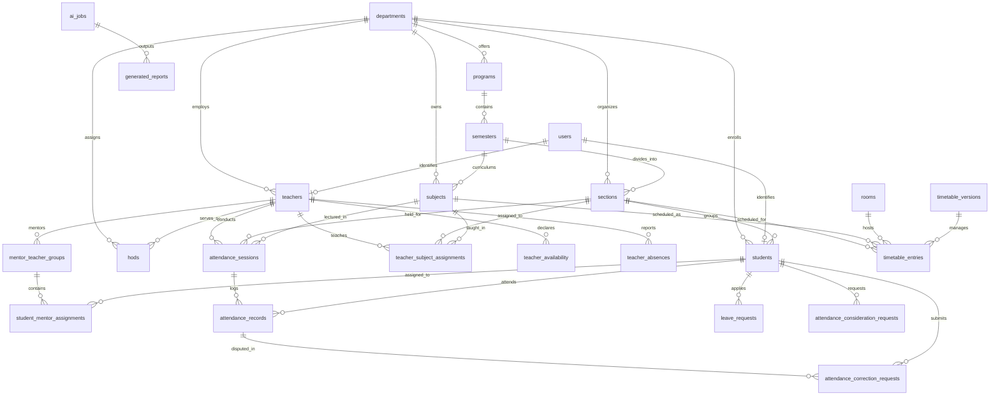

# CampusFlow CSE Department ERP — Database Architecture & Core ERD

This document specifies the normalized relational database architecture for the CampusFlow Departmental ERP, covering the 3-tier database stack: **PostgreSQL** (Source of Truth Relational ERP), **MongoDB** (Application Session Data, Profiles & LLM Short-Term Memory), and **Qdrant** (Vector Store for Long-Term Memory & RAG Embeddings).

---

## 1. Multi-Database Architecture

| Storage Layer | Technology | Primary Responsibilities | Data Characteristics |
| :--- | :--- | :--- | :--- |
| **Relational Core** | **PostgreSQL 16** | Core institutional records, Students, Teachers, HODs, Timetables, Attendance Ledger, Leaves, Audit Trail | Normalized (3NF), UUID PKs, Foreign Keys, CHECK constraints, Relational integrity |
| **Document Store** | **MongoDB Atlas** | Fast user session cache, LLM Short-Term Memory (STM), real-time chat histories, raw telemetry | JSON documents, TTL indexes, high-throughput writes |
| **Vector Engine** | **Qdrant Vector DB** | LLM Long-Term Memory (LTM), syllabus & notes semantic embeddings, RAG document chunks | 1536-dim vectors, cosine distance, metadata payload filtering |

---

## 2. Entity Relationship Diagram (ERD)

---

## 3. Relational Mapping Matrix (Entity -> Relationship -> Foreign Key -> Cardinality)

| Parent Entity | Child Entity | Foreign Key Column | Cardinality | Business Description & Constraints |
| :--- | :--- | :--- | :--- | :--- |
| `departments` | `programs` | `programs.department_id` | 1 : N | A department offers multiple degree programs (e.g. B.Tech CSE). |
| `departments` | `teachers` | `teachers.department_id` | 1 : N | A teacher belongs strictly to one department. |
| `departments` | `students` | `students.department_id` | 1 : N | A student belongs strictly to one parent department. |
| `departments` | `subjects` | `subjects.department_id` | 1 : N | A subject is owned and administered by a single department. |
| `departments` | `sections` | `sections.department_id` | 1 : N | A section is organized under a single department. |
| `departments` | `hods` | `hods.department_id` | 1 : N | Department HOD assignments. Unique index ensures **max 1 active HOD per department**. |
| `programs` | `semesters` | `semesters.program_id` | 1 : N | A program consists of consecutive academic semesters (1 to 8). |
| `semesters` | `sections` | `sections.semester_id` | 1 : N | A semester is divided into student cohort sections (A, B, C). |
| `semesters` | `subjects` | `subjects.semester_id` | 1 : N | Standard semester curriculum mapping. |
| `users` | `students` | `students.user_id` | 1 : 1 | Central authentication identity linked to student profile. |
| `users` | `teachers` | `teachers.user_id` | 1 : 1 | Central authentication identity linked to faculty profile. |
| `teachers` | `hods` | `hods.teacher_id` | 1 : N | Prevents person duplication; a teacher is assigned HOD responsibilities. |
| `teachers` | `mentor_teacher_groups` | `mentor_teacher_groups.teacher_id` | 1 : N | Faculty designated as Teacher Guardian (TG) for mentor cohorts. |
| `mentor_teacher_groups` | `student_mentor_assignments` | `student_mentor_assignments.mentor_group_id` | 1 : N | A mentor group encompasses multiple assigned students. |
| `students` | `student_mentor_assignments` | `student_mentor_assignments.student_id` | 1 : N | Unique constraint on `(student_id, academic_year)` prevents multiple mentors per year. |
| `sections` | `students` | `students.section_id` | 1 : N | A student belongs to one active section. |
| `teachers` | `teacher_subject_assignments` | `teacher_subject_assignments.teacher_id` | 1 : N | Faculty allocation matrix (Teacher -> Subject -> Section). |
| `subjects` | `teacher_subject_assignments` | `teacher_subject_assignments.subject_id` | 1 : N | Enables multiple teachers to teach different sections of the same subject. |
| `sections` | `teacher_subject_assignments` | `teacher_subject_assignments.section_id` | 1 : N | Target section for the faculty teaching allocation. |
| `timetable_versions` | `timetable_entries` | `timetable_entries.timetable_version` | 1 : N | Links scheduled entries to an AI or manual timetable draft/published version. |
| `sections` | `timetable_entries` | `timetable_entries.section_id` | 1 : N | Section timetable schedule. Unique collision check prevents section double-booking. |
| `subjects` | `timetable_entries` | `timetable_entries.subject_id` | 1 : N | Subject allocated to a specific timetable slot. |
| `teachers` | `timetable_entries` | `timetable_entries.teacher_id` | 1 : N | Faculty assigned to teach slot. Unique collision check prevents teacher double-booking. |
| `rooms` | `timetable_entries` | `timetable_entries.room_id` | 1 : N | Physical classroom/lab assigned. Collision check prevents room double-booking. |
| `teachers` | `teacher_availability` | `teacher_availability.teacher_id` | 1 : N | Availability constraints declared by faculty for the AI scheduler. |
| `teachers` | `teacher_absences` | `teacher_absences.teacher_id` | 1 : N | Recorded leave/absence triggering AI substitution recommendations. |
| `sections` | `attendance_sessions` | `attendance_sessions.section_id` | 1 : N | Section cohort participating in the roll-call session. |
| `subjects` | `attendance_sessions` | `attendance_sessions.subject_id` | 1 : N | Course/subject for which attendance was taken. |
| `teachers` | `attendance_sessions` | `attendance_sessions.teacher_id` | 1 : N | Faculty member who conducted the lecture and marked roll-call. |
| `timetable_entries` | `attendance_sessions` | `attendance_sessions.timetable_entry_id` | 1 : 1 | Links attendance session directly to the scheduled timetable slot. |
| `attendance_sessions` | `attendance_records` | `attendance_records.session_id` | 1 : N | Ledger of student attendance. Unique constraint on `(session_id, student_id)`. |
| `students` | `attendance_records` | `attendance_records.student_id` | 1 : N | Attendance percentage computed dynamically from these ledger entries. |
| `students` | `attendance_correction_requests` | `attendance_correction_requests.student_id` | 1 : N | Dispute submitted by student for an erroneous attendance record. |
| `attendance_records` | `attendance_correction_requests` | `attendance_correction_requests.attendance_record_id` | 1 : N | Target attendance entry being disputed by the student. |
| `students` | `leave_requests` | `leave_requests.student_id` | 1 : N | Multi-tier approval leave workflow (Student -> TG -> HOD Fallback). |
| `teachers` | `leave_requests` | `leave_requests.tg_id` | 1 : N | Assigned TG who reviews and recommends the leave application. |
| `teachers` | `leave_requests` | `leave_requests.hod_id` | 1 : N | HOD who grants final official leave clearance. |
| `students` | `attendance_consideration_requests` | `attendance_consideration_requests.student_id` | 1 : N | Institutional duty/hackathon attendance consideration requests reviewed by HOD. |
| `ai_jobs` | `generated_reports` | `generated_reports.ai_job_id` | 1 : N | PDF / Excel generated exports linked to the originating AI asynchronous job. |

---

## 4. Key Business Constraints & Invariants

1. **Non-Destructive Deletions:**
   - Academic records, attendance records, timetable entries, and leaves enforce `ON DELETE RESTRICT` or `ON DELETE SET NULL`.
   - Historical audit trails and attendance logs remain permanently recoverable.

2. **Timetable Collision Invariants:**
   - **Teacher Double-Booking:** A teacher cannot be scheduled in two locations simultaneously (`teacher_id`, `day_of_week`, `start_time`).
   - **Room Double-Booking:** A classroom/lab cannot host two sections simultaneously (`room_id`, `day_of_week`, `start_time`).
   - **Section Double-Booking:** A cohort of students cannot attend two subjects simultaneously (`section_id`, `day_of_week`, `start_time`).

3. **Attendance Ledger Accuracy:**
   - Attendance is never stored as an unbacked static percentage.
   - Every attendance mark is a ledger row in `attendance_records` bound to an `attendance_sessions` entry.
   - Aggregate percentages are computed dynamically: `(attended_records / total_sessions) * 100`.

4. **Multi-Tier Approvals (Student -> TG -> HOD Fallback):**
   - Leave applications and attendance corrections are first routed to the student's assigned Teacher Guardian (TG).
   - If the TG is unavailable or has not acted, the HOD can directly review and grant clearance via automatic fallback routing.

5. **AI Timetable Safety:**
   - AI generation jobs output schedules with `status: 'DRAFT'`.
   - The AI agent is prohibited from silently overwriting the active institutional timetable.
   - Only the HOD or Admin can explicitly activate a version (`status: 'ACTIVE'`), which automatically archives previous versions while preserving full audit history.
