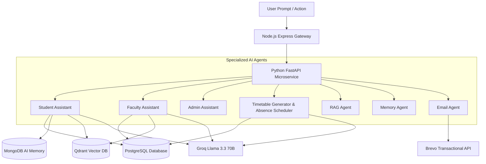

# CSE Department AI Agentic ERP — Architecture & Specifications

## 1. System Overview
The **CSE Department Agentic ERP** is a dedicated enterprise resource planning system purpose-built exclusively for the **Computer Science & Engineering Department**. It eliminates generic college multi-department overhead and structures all records strictly according to the CSE academic hierarchy:

```
CSE Department
├── 1st Year (Semester 1, Semester 2)  -> Sections A, B
├── 2nd Year (Semester 3, Semester 4)  -> Sections A, B
├── 3rd Year (Semester 5, Semester 6)  -> Sections A, B
└── 4th Year (Semester 7, Semester 8)  -> Sections A, B
```

---

## 2. Tech Stack & Responsibilities

| Purpose | Technology | Function |
| :--- | :--- | :--- |
| **Frontend** | React (Vite) | Role-based UI (Student, Faculty, Admin, HOD, TG), interactive AI drawer |
| **API Gateway** | Node.js + Express | Central gateway, JWT authentication, RBAC, file storage, Winston logging |
| **Relational DB** | PostgreSQL 16 (`pg` / Sequelize ORM) | Normalized ERP source of truth: Students, Faculty, HODs, Departments, Subjects, Sections, Timetables, Attendance, Leaves, Availability |
| **AI Memory DB** | MongoDB 7.0 (Mongoose) | Long-term facts, conversation threads, short-term memory, session summaries |
| **AI Microservice** | Python 3.10 + FastAPI | Multi-agent coordination, Groq LLM inference, timetable optimization, document extraction |
| **LLM Inference** | Groq SDK (Llama 3.3 70B) | Streaming responses, retry logic, token usage tracking, academic reasoning |
| **Vector DB** | Qdrant | Dense vector search, hybrid retrieval across departmental collections |
| **Transactional Email** | Brevo (formerly Sendinblue) | Real-time OTP dispatch, attendance shortage alerts (<75%), assignment deadlines |
| **Logging** | Winston | Domain-separated streams: `api.log`, `error.log`, `ai.log`, `email.log` |
| **API Documentation** | Swagger (OpenAPI 3.0) | Interactive documentation at `/api-docs` |
| **Deployment** | Render Blueprint (`render.yaml`) | Managed Render PostgreSQL, Node Web Service, Python Web Service, Static Frontend |

---

## 3. Relational Schema (Normalized PostgreSQL)

The relational schema is defined through transactional PostgreSQL migrations (`backend/src/migrations/001_initial_postgresql_schema.sql`) and tracked via `schema_migrations`:

1. **`users`**: Central authentication table with hashed passwords, roles (`student`, `faculty`, `hod`, `admin`, `tg`), JWT refresh tokens, and OTP codes.
2. **`departments`**: Academic departments with code, name, and HOD reference.
3. **`students`**: Enrollment number, full name, email, phone, year, semester, section, batch, guardian details, academic standing.
4. **`faculty`**: Designation, specialization, email, phone, cabin, department ID, max weekly hours.
5. **`hods`**: Department leadership appointments, office locations, appointment terms.
6. **`subjects`**: Course codes (e.g. CS501), subject names, semester, credits, lecture/practical hours, department.
7. **`classes` / `sections`**: Year, semester, section names (e.g. 3rd Year, Semester 5, Section A), assigned mentors.
8. **`classrooms`**: Room numbers, building, capacity, projector/lab facilities.
9. **`timetables`**: Day of week, period, start_time, end_time, subject, teacher, classroom, section, status, effective dates.
10. **`attendance`**: Student ID, subject, teacher, date, status (`Present`, `Absent`, `Late`, `Excused`), remarks.
11. **`leave_requests`**: Teacher/Student leave applications with date intervals, reason, status (`Pending`, `Approved`, `Rejected`), approver details.
12. **`attendance_queries`**: Correction requests raised by students with attached evidence, resolution status, and reviewer notes.
13. **`teacher_availability`**: Day and time-slot level availability matrix, max load constraints, leave flags.
14. **`scheduling_constraints`**: Entity-specific constraints (hard/soft), weightages, room capacities, consecutive lecture caps.
15. **`assignments`**: Title, description, deadline, subject ID, max marks, attached file.
16. **`assignment_submissions`**: Student ID, assignment ID, submission file URL, marks, feedback, status.
17. **`audit_logs`**: System-wide administrative action logs, AI timetable generation logs, substitution adjustment trails.

---

## 4. Multi-Agent Ecosystem



1. **Student Assistant**: Resolves queries about classes, attendance standing, pending assignment deadlines, and faculty office hours.
2. **Faculty Assistant**: Generates assignments with evaluation rubrics, summarizes batches of student submissions, drafts circular emails, and analyzes class attendance trends.
3. **Admin Assistant**: Generates executive attendance compliance audits, audits faculty workload distribution, and detects classes with missing roll calls.
4. **Timetable & Absence Agent**: Queries PostgreSQL for teachers, rooms, subjects, and availability; generates conflict-free schedules; computes substitutions for absent teachers; persists directly to PostgreSQL; exports PDF and Excel.
5. **RAG Agent**: Extracts text from PDF/DOCX/PPT, computes vector embeddings, and performs hybrid search across Qdrant collections.
6. **Memory Agent**: Maintains short-term conversation context, persistent long-term student/faculty facts in MongoDB, and triggers rolling conversation summarization.
7. **Email Agent**: Dispatches OTPs, assignment reminders, attendance shortage warnings (<75%), and circular notices via Brevo.
