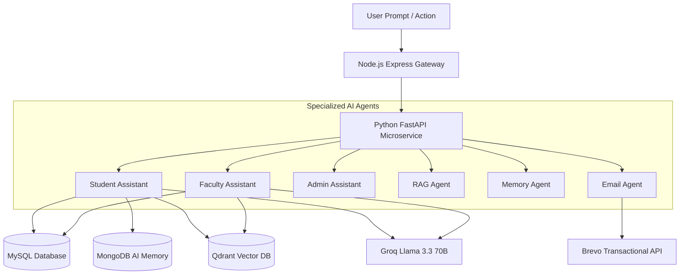

# CSE Department AI Agentic ERP — Architecture & Specifications

## 1. System Overview
The **CSE Department Agentic ERP** is a dedicated enterprise resource planning system purpose-built exclusively for the **Computer Science & Engineering Department**. It eliminates generic college multi-department overhead and structures all records strictly according to the CSE academic hierarchy:

```
CSE Department
├── 1st Year (Semester 1, Semester 2)  -> Sections A, B
├── 2nd Year (Semester 3, Semester 4)  -> Sections A, B
├── 3rd Year (Semester 5, Semester 6)  -> Sections A, B
└── 4th Year (Semester 7, Semester 8)  -> Sections A, B
```

---

## 2. Tech Stack & Responsibilities

| Purpose | Technology | Function |
| :--- | :--- | :--- |
| **Frontend** | React (Vite) | Role-based UI (Student, Faculty, Admin, HOD, TG), interactive AI drawer |
| **API Gateway** | Node.js + Express | Central gateway, JWT authentication, RBAC, file storage, Winston logging |
| **Relational DB** | MySQL 8.0 (Sequelize ORM) | Normalized records: Students, Faculty, Subjects, Sections, Timetable, Attendance, Assignments |
| **AI Memory DB** | MongoDB 7.0 (Mongoose) | Long-term facts, conversation threads, short-term memory, session summaries |
| **AI Microservice** | Python 3.10 + FastAPI | Multi-agent coordination, Groq LLM inference, document text extraction |
| **LLM Inference** | Groq SDK (Llama 3.3 70B) | Streaming responses, retry logic, token usage tracking, academic reasoning |
| **Vector DB** | Qdrant | Dense vector search, hybrid retrieval across 7 departmental collections |
| **Transactional Email** | Brevo (formerly Sendinblue) | Real-time OTP dispatch, attendance shortage alerts (<75%), assignment deadlines |
| **Logging** | Winston | Domain-separated streams: `api.log`, `error.log`, `ai.log`, `email.log` |
| **API Documentation** | Swagger (OpenAPI 3.0) | Interactive documentation at `/api-docs` |

---

## 3. Relational Schema (Normalized MySQL)

1. **`users`**: Central authentication table with hashed passwords, JWT refresh tokens, and OTP codes.
2. **`students`**: Enrollment number, name, email, phone, year, semester, section, batch, status.
3. **`faculty`**: Designation, specialization, email, phone.
4. **`subjects`**: Course code (e.g. CS501), subject name, semester, credits.
5. **`sections`**: Year, semester, section name (e.g. 3rd Year, Semester 5, Section A).
6. **`attendance`**: Student ID, Subject ID, Faculty ID, Date, Status (`Present`, `Absent`, `Late`, `Excused`).
7. **`assignments`**: Title, description, deadline, subject ID, max marks, attached file.
8. **`assignment_submissions`**: Student ID, assignment ID, submission file URL, marks, feedback, status.
9. **`timetable`**: Year, semester, section, day, start_time, end_time, subject, faculty, room.
10. **`notes`**: Title, description, file URL, file type, category, subject ID, faculty ID, year, semester, RAG indexing status.

---

## 4. Vector Database & RAG (Pinecone — 768 Dimensions)

The RAG pipeline utilizes **Pinecone** with **768-dimensional dense vectors** and Cosine distance. Documents are indexed under dedicated namespaces/metadata partitions for the 7 departmental categories:
- `Notes`: Lecture slides, PDF notes, reference guides.
- `Assignments`: Problem sets, code templates, assignment rubrics.
- `Circulars`: Official department notices, exam schedules, seat plans.
- `Syllabus`: RGPV/University CSE 4-year curricula and course outcomes.
- `Lab Manuals`: Practical experiments, code instructions, software requirements.
- `Previous Papers`: University and mid-semester previous year question papers.
- `Faculty Documents`: Faculty publications, syllabus outlines, departmental policies.

*Architecture features automatic Serverless index creation, namespace isolation, and local 768-dim fallback for offline development.*

---

## 5. Multi-Agent Ecosystem



1. **Student Assistant**: Resolves queries about classes, attendance standing, pending assignment deadlines, and faculty office hours.
2. **Faculty Assistant**: Generates assignments with evaluation rubrics, summarizes batches of student submissions, drafts circular emails, and analyzes class attendance trends.
3. **Admin Assistant**: Generates executive attendance compliance audits, audits faculty workload distribution, and detects classes with missing roll calls.
4. **RAG Agent**: Extracts text from PDF/DOCX/PPT, computes vector embeddings, and performs hybrid search across Qdrant collections.
5. **Memory Agent**: Maintains short-term conversation context, persistent long-term student/faculty facts in MongoDB, and triggers rolling conversation summarization.
6. **Email Agent**: Dispatches OTPs, assignment reminders, attendance shortage warnings (<75%), and circular notices via Brevo.
