# CampusFlow ERP — Official System Architecture Document

**Project Title:** CampusFlow — College Departmental Agentic ERP  
**Department:** Computer Science & Engineering (CSE), OIST  
**Version:** 2.0.0  
**Date:** October 2026  
**Authors:** Department of CSE, Oriental Institute of Science & Technology

---

## Table of Contents

1. [Executive Summary](#1-executive-summary)
2. [System Overview & Design Philosophy](#2-system-overview--design-philosophy)
3. [High-Level Architecture Diagram](#3-high-level-architecture-diagram)
4. [Technology Stack](#4-technology-stack)
5. [Tri-Database Architecture](#5-tri-database-architecture)
6. [Backend API Gateway (Node.js/Express)](#6-backend-api-gateway-nodejsexpress)
7. [AI Microservice (Python/FastAPI)](#7-ai-microservice-pythonfastapi)
8. [Frontend Application (React/Vite)](#8-frontend-application-reactvite)
9. [Authentication & Security Model](#9-authentication--security-model)
10. [Role-Based Access Control (RBAC)](#10-role-based-access-control-rbac)
11. [Multi-Agent AI Orchestration Pipeline](#11-multi-agent-ai-orchestration-pipeline)
12. [Timetable Generation Engine](#12-timetable-generation-engine)
13. [Document RAG Pipeline](#13-document-rag-pipeline)
14. [Real-Time Communication (Socket.IO)](#14-real-time-communication-socketio)
15. [File Processing Pipeline](#15-file-processing-pipeline)
16. [Request & Approval Workflow Engine](#16-request--approval-workflow-engine)
17. [Attendance Management System](#17-attendance-management-system)
18. [Leave Management System](#18-leave-management-system)
19. [Data Models & Entity Relationship Diagram](#19-data-models--entity-relationship-diagram)
20. [API Route Map](#20-api-route-map)
21. [Frontend Page Architecture & Routing](#21-frontend-page-architecture--routing)
22. [Deployment Architecture](#22-deployment-architecture)
23. [Monitoring & Health Checks](#23-monitoring--health-checks)
24. [External Service Integrations](#24-external-service-integrations)
25. [Glossary](#25-glossary)

---

## 1. Executive Summary

**CampusFlow** is a full-stack, AI-powered **College Departmental Enterprise Resource Planning (ERP)** system built for the CSE Department at OIST. It is designed as a production-grade academic management platform that unifies:

- **Academic Operations**: Timetable generation, attendance tracking, class management, and subject enrollment.
- **Administrative Workflows**: Leave applications, attendance correction & consideration requests, teacher substitutions, and multi-tier approval chains (Student → TG → HOD).
- **Intelligent Automation**: A **multi-agent AI orchestration layer** powered by LLMs (Groq/Qwen), vector search (Qdrant), and deterministic constraint solvers for autonomous timetable generation, teacher scheduling, absence management, and natural-language ERP queries.
- **Document Intelligence**: A RAG (Retrieval-Augmented Generation) pipeline that ingests syllabi, circulars, and academic documents into a vector database for semantic search and AI-grounded responses.

The system serves **five distinct user roles** — Student, Teacher, Tutor Guardian (TG), Head of Department (HOD), and System Administrator — each with dedicated dashboards, permissions, and workflow capabilities.

---

## 2. System Overview & Design Philosophy

### 2.1 Core Design Principles

| Principle | Description |
|---|---|
| **Tri-Database Separation** | PostgreSQL for relational ERP truth, MongoDB for AI memory & conversations, Qdrant for vector embeddings & RAG — each database serves its optimal purpose. |
| **Agentic AI Layer** | Natural-language interface backed by 10+ specialized AI agents that can query databases, generate timetables, manage substitutions, and produce reports autonomously. |
| **Graceful Degradation** | MongoDB and Qdrant failures do not crash the core ERP. The system degrades to stateless AI mode while all transactional operations remain fully functional on PostgreSQL. |
| **Role-Based Everything** | Every API endpoint, UI route, sidebar navigation item, and AI agent action is gated by an RBAC permission matrix derived from PostgreSQL. |
| **Non-Destructive Operations** | Teacher substitutions use a `DailySubstitution` overlay table rather than mutating the master timetable. Leave approvals, corrections, and considerations all follow immutable audit trails. |

### 2.2 Architectural Style

CampusFlow follows a **microservice-oriented monolith** architecture:

- A **Node.js Express monolith** serves as the primary API gateway, handling authentication, CRUD operations, business logic, and real-time events.
- A **Python FastAPI microservice** handles all AI/ML workloads: LLM inference, agent orchestration, timetable constraint solving, document processing, and vector search.
- A **React SPA** provides the single unified frontend for all roles.

The two backend services communicate via internal REST APIs (`PYTHON_AI_SERVICE_URL`), while the frontend communicates exclusively with the Node.js gateway.

---

## 3. High-Level Architecture Diagram

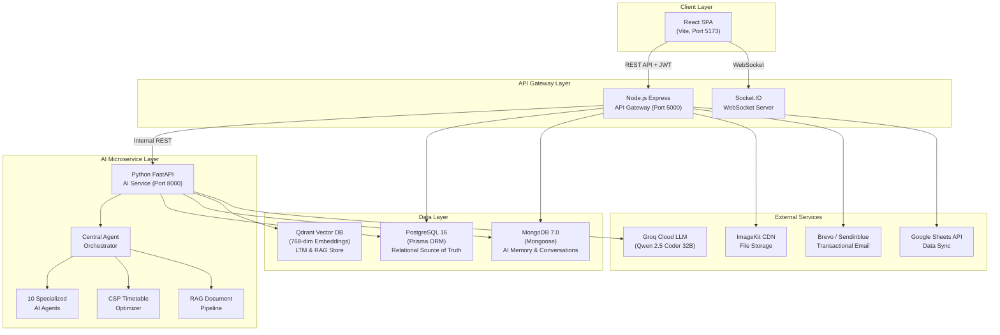

---

## 4. Technology Stack

### 4.1 Complete Technology Matrix

| Layer | Technology | Version | Purpose |
|---|---|---|---|
| **Frontend** | React | 18.x | Component-based UI framework |
| | Vite | 5.x | Build tool & dev server |
| | React Router | 6.x | Client-side routing |
| | Lucide React | Latest | Icon library |
| | Axios | Latest | HTTP client |
| | React Markdown | Latest | AI response rendering |
| | KaTeX | Latest | Mathematical formula rendering |
| **Backend** | Node.js | 20.x | JavaScript runtime |
| | Express.js | 4.x | HTTP framework |
| | Prisma | 5.x | PostgreSQL ORM & schema manager |
| | Mongoose | 7.x | MongoDB ODM |
| | Socket.IO | 4.x | Real-time bidirectional events |
| | JSON Web Token | Latest | Authentication tokens |
| | Helmet | Latest | HTTP security headers |
| | Multer | Latest | File upload middleware |
| | Winston | Latest | Structured logging |
| | Nodemon | Latest | Development hot-reload |
| **AI Service** | Python | 3.11+ | AI/ML runtime |
| | FastAPI | Latest | Async API framework |
| | Groq SDK | Latest | LLM inference client |
| | Sentence-Transformers | Latest | Local embedding model |
| | Qdrant Client | Latest | Vector DB client |
| | PyMongo | Latest | MongoDB driver |
| | Psycopg2 | Latest | PostgreSQL driver |
| | Loguru | Latest | Structured logging |
| | Pydantic | 2.x | Request/response validation |
| **Databases** | PostgreSQL | 16 | Relational ERP data |
| | MongoDB | 7.0 | Document store for AI memory |
| | Qdrant | Latest | Vector similarity search |
| **Infrastructure** | Docker Compose | 3.8 | Container orchestration |
| | Render | — | Cloud deployment platform |
| | ImageKit | — | CDN & image processing |
| | Brevo/Sendinblue | — | Transactional email |

---

## 5. Tri-Database Architecture

CampusFlow employs a deliberate **polyglot persistence** strategy where each database is selected for the specific access patterns it excels at:

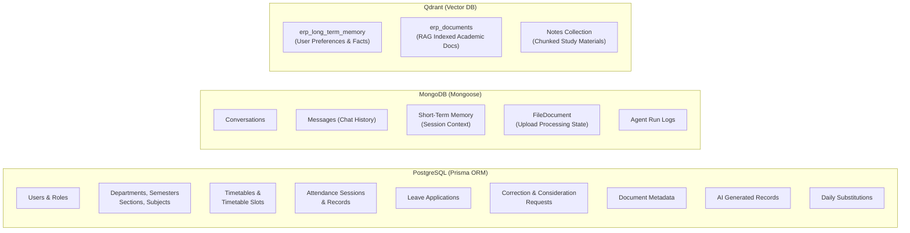

### 5.1 PostgreSQL — Relational Source of Truth

**Role:** Authoritative, ACID-compliant store for all transactional ERP data.

- **ORM:** Prisma Client with declarative schema (`schema.prisma`)
- **Models (25 tables):**

| # | Model | Purpose |
|---|---|---|
| 1 | `Role` | ADMIN, HOD, TEACHER, TG, STUDENT role definitions |
| 2 | `Department` | Academic departments (e.g., CSE) |
| 3 | `AcademicSession` | Academic year sessions (e.g., 2026-27) |
| 4 | `Semester` | Semester instances per department |
| 5 | `Section` | Class sections (A, B) with TG assignment |
| 6 | `User` | Canonical identity with role, department, auth credentials |
| 7 | `Teacher` | Faculty profile with workload limits, TG flag, designation |
| 8 | `HOD` | Head of Department assignment (teacher → department mapping) |
| 9 | `Student` | Student profile with enrollment, section, TG assignment |
| 10 | `Subject` | Course catalog with credits, weekly hours, semester |
| 11 | `Enrollment` | Student ↔ Subject enrollment records |
| 12 | `TeacherSubject` | Faculty ↔ Subject ↔ Section teaching assignments |
| 13 | `Classroom` | Physical rooms (halls, labs) with capacity |
| 14 | `Timetable` | Master timetable versions (DRAFT → APPROVED → ACTIVE) |
| 15 | `TimetableSlot` | Individual period slots (day, time, subject, teacher, room) |
| 16 | `Attendance` | Attendance sessions per subject/date/period |
| 17 | `AttendanceRecord` | Individual student attendance marks (PRESENT/ABSENT/LATE) |
| 18 | `AttendanceCorrectionRequest` | Student requests to correct marked attendance |
| 19 | `AttendanceConsiderationRequest` | Attendance exemption requests (medical, sports, etc.) |
| 20 | `LeaveApplication` | Leave requests for students and teachers |
| 21 | `Notification` | System notifications with role-based targeting |
| 22 | `DocumentMetadata` | File metadata with Qdrant indexing status |
| 23 | `AIGeneratedRecord` | Audit trail for AI-produced outputs (timetables, reports) |
| 24 | `DailySubstitution` | Non-destructive teacher substitution overlay |
| 25 | `PasswordResetToken` | Hashed OTP tokens for password recovery |

### 5.2 MongoDB — AI Memory & Application State

**Role:** Flexible document store for AI conversational memory and file processing state.

| Collection | Schema | Purpose |
|---|---|---|
| `conversations` | `Conversation.js` | Chat session metadata (user, role, timestamps) |
| `messages` | `Message.js` | Individual chat messages with sender, content, citations |
| `shorttermmemorys` | `ShortTermMemory.js` | AI session context (current task, working data) |
| `filedocuments` | `FileDocument.js` | Uploaded file processing lifecycle (PENDING → PROCESSING → READY) |
| `agentruns` | `AgentRun.js` | AI agent execution audit logs |
| `aimemorydocuments` | `aiMemoryModels.js` | Extended AI memory for preferences and interaction patterns |

**Degradation Policy (ARCH-01):** If MongoDB is unavailable at startup, CampusFlow logs a warning and continues with `app.locals.mongoAvailable = false`. AI features degrade to stateless mode, but all core ERP operations (attendance, timetable, leaves, requests) remain fully operational via PostgreSQL.

### 5.3 Qdrant — Vector Embeddings & RAG

**Role:** High-performance vector similarity search for AI long-term memory and document retrieval.

| Collection | Dimensions | Purpose |
|---|---|---|
| `erp_long_term_memory` | 768 | Stored user preferences, repeated facts, and behavioral patterns extracted from conversations |
| `erp_documents` | 768 | Chunked and embedded academic documents (syllabi, circulars, policies, notes) for RAG retrieval |
| `Notes` | 768 | Dedicated collection for study material chunks |

**Embedding Model:** `sentence-transformers/all-mpnet-base-v2` (768-dimensional, L2-normalized dense vectors)

---

## 6. Backend API Gateway (Node.js/Express)

### 6.1 Server Architecture

The backend server (`server.js`) is built on Express.js and serves as the **single API gateway** for all client-facing operations:

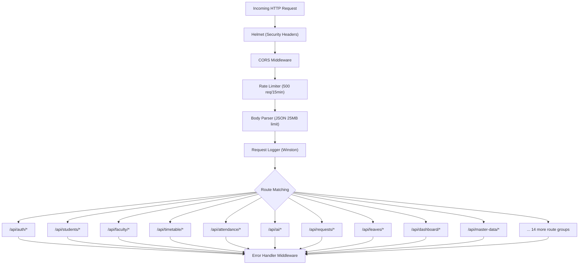

### 6.2 Middleware Stack

| Order | Middleware | File | Purpose |
|---|---|---|---|
| 1 | `helmet()` | Built-in | Sets security-related HTTP headers (X-Frame-Options, CSP, etc.) |
| 2 | `cors(corsOptions)` | `server.js` | Whitelisted origin validation (configurable via `CORS_ORIGINS` env) |
| 3 | `rateLimit()` | `server.js` | 500 requests per 15-minute window per IP |
| 4 | `express.json()` | Built-in | JSON body parsing with 25MB limit |
| 5 | `requestLogger` | `middleware/requestLogger.js` | Winston structured request logging |
| 6 | `verifyToken` | `middleware/auth.js` | JWT verification + PostgreSQL user resolution (60s cache) |
| 7 | `requireRole()` | `middleware/auth.js` | Role-based access control enforcement |
| 8 | `requirePermission()` | `middleware/auth.js` | Fine-grained permission checks |
| 9 | `errorHandler` | `middleware/errorHandler.js` | Centralized error response formatting |

### 6.3 Controller Modules (23 Controllers)

| Controller | File | Responsibilities |
|---|---|---|
| `authController` | `authController.js` | Login, registration, JWT issuance/refresh, password reset (OTP), profile management |
| `aiController` | `aiController.js` | AI chat proxy to FastAPI, intent detection, ERP agent tool execution, Google Sheet sync |
| `timetableController` | `timetableController.js` | Timetable CRUD, version management, slot manipulation, approval workflows |
| `attendanceController` | `attendanceController.js` | Mark attendance, QR generation, attendance summaries, correction processing |
| `requestController` | `requestController.js` | Attendance corrections, consideration requests, multi-tier approval chains |
| `leaveController` | `leaveController.js` | Leave applications, TG recommendations, HOD approvals, teacher availability |
| `dashboardController` | `dashboardController.js` | Role-specific dashboard stats, today's schedule, active subjects |
| `masterDataController` | `masterDataController.js` | Bulk import/export (teachers, students, subjects, classrooms, timetables) |
| `facultyController` | `facultyController.js` | Teacher CRUD, TG assignments, workload management |
| `studentController` | `studentController.js` | Student profile management, enrollment records |
| `fileController` | `fileController.js` | File upload to ImageKit, processing dispatch to AI service |
| `noticeController` | `noticeController.js` | Department notices and announcements |
| `notificationController` | `notificationController.js` | Push notification management |
| `adminController` | `adminController.js` | System administration, user management, HOD appointments |
| `academicController` | `academicController.js` | Departments, semesters, sections, academic sessions |
| `classroomController` | `classroomController.js` | Room/lab management |
| `teacherSchedulerController` | `teacherSchedulerController.js` | Absence reporting, substitution proposals, daily schedule adjustments |
| `assignmentController` | `assignmentController.js` | Assignment creation and submission management |
| `agentController` | `agentController.js` | AI agent status and monitoring |
| `storageController` | `storageController.js` | Static file serving and storage management |
| `notesController` | `notesController.js` | Academic notes and study material management |
| `cseStructureController` | `cseStructureController.js` | Department structure visualization |

### 6.4 Service Layer

| Service | File | Purpose |
|---|---|---|
| `erpAgentTools` | `erpAgentTools.js` | ERP-specific AI tool execution (timetable generation, attendance queries, document status checks) |
| `agentService` | `agentService.js` | Agent lifecycle management and orchestration bridge |
| `timetableAiEngine` | `timetableAiEngine.js` | Timetable generation coordination between Node.js and FastAPI |
| `attendanceService` | `attendanceService.js` | Attendance calculation and summary generation |
| `leaveService` | `leaveService.js` | Leave business logic and validation |
| `emailService` | `emailService.js` | Brevo/Sendinblue transactional email dispatch |
| `excelService` | `excelService.js` | Excel (XLSX) export generation |
| `pdfService` | `pdfService.js` | PDF report and timetable generation |
| `googleSheetSyncService` | `googleSheetSyncService.js` | Google Sheets bidirectional data sync |
| `imageKitService` | `imageKitService.js` | ImageKit CDN upload and URL management |
| `cacheService` | `cacheService.js` | In-memory caching with TTL |
| `loggerService` | `loggerService.js` | Winston logger configuration |

---

## 7. AI Microservice (Python/FastAPI)

### 7.1 Service Architecture

The AI microservice is a standalone **Python FastAPI** application that handles all AI/ML workloads:

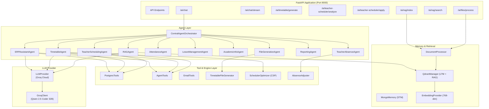

### 7.2 Agent Registry (10 Specialized Agents)

| Agent | Class | Capabilities |
|---|---|---|
| **ERP Assistant** | `ERPAssistantAgent` | General ERP queries, student/faculty info, system status, contextual help |
| **Timetable Agent** | `TimetableAgent` | AI-powered timetable generation, slot manipulation, conflict resolution, export |
| **Teacher Scheduling** | `TeacherSchedulingAgent` | Faculty workload analysis, period distribution, schedule optimization |
| **Teacher Absence** | `TeacherAbsenceAgent` | Absence analysis, substitute ranking, substitution proposal generation |
| **Attendance Agent** | `AttendanceAgent` | Attendance percentage queries, shortage alerts, trend analysis |
| **Leave Management** | `LeaveManagementAgent` | Leave status queries, policy information, application guidance |
| **Academic Info** | `AcademicInformationAgent` | Curriculum, credits, course catalog, classroom availability |
| **RAG Agent** | `RAGAgent` | Semantic document search, syllabus Q&A, policy retrieval with citations |
| **Reporting Agent** | `ReportingAgent` | Department analytics, operational summaries, audit reports |
| **File Generation** | `FileGenerationAgent` | PDF/XLSX timetable export, downloadable report generation |

### 7.3 LLM Provider Chain

```
User Query → CentralOrchestrator → Intent Detection → Agent Selection
    → Agent.handle_request()
        → Tool Calls (PostgreSQL queries, Qdrant search)
        → LLM Reasoning (Groq Cloud: Qwen-2.5-Coder-32B)
        → Structured Response Generation
    → Save to MongoDB STM
    → Optionally store in Qdrant LTM (user preferences)
    → Return structured JSON response
```

---

## 8. Frontend Application (React/Vite)

### 8.1 Application Shell

The frontend is a **single-page application (SPA)** built with React 18 and Vite, organized around a unified `DashboardLayout` shell:

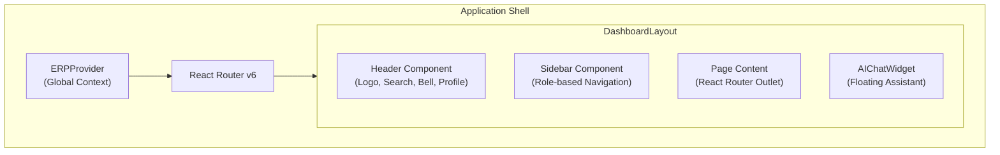

### 8.2 Global State Management

The `ERPContext.jsx` provides centralized state management via React Context API:

| State | Description |
|---|---|
| `currentUser` | Authenticated user object from PostgreSQL (name, email, role, permissions) |
| `currentRole` | Effective role: `student`, `teacher`, `tg`, `hod`, `admin` |
| `isAuthenticated` | Boolean authentication status |
| `loadingAuth` | Loading state during session verification |
| `token` | JWT access token stored in localStorage |
| `dashboard` | Cached dashboard statistics |
| `modals` | Global modal state (leave application, notice detail, feedback, etc.) |

### 8.3 Page Architecture by Role

#### Student Pages (7 pages)
| Route | Component | Features |
|---|---|---|
| `/student` | `StudentDashboard` | Today's schedule, attendance summary, quick actions |
| `/student/attendance` | `StudentAttendance` | Subject-wise attendance, percentage tracking, correction requests |
| `/student/timetable` | `StudentTimetable` | Weekly timetable view with active schedule |
| `/student/assignments` | `StudentAssignments` | View and submit assignments |
| `/student/requests` | `StudentRequests` | Submit correction/consideration requests, view status |
| `/student/notices` | `StudentNotices` | Department notices and announcements |
| `/student/profile` | `StudentProfile` | Personal profile management |

#### Teacher Pages (9 pages)
| Route | Component | Features |
|---|---|---|
| `/teacher` | `TeacherDashboard` | Today's classes, pending attendance, quick actions |
| `/teacher/attendance` | `TeacherMarkAttendance` | Mark attendance for assigned classes |
| `/teacher/lectures` | `TeacherLectures` | Lecture management and scheduling |
| `/teacher/assignments` | `TeacherAssignments` | Create and manage assignments |
| `/teacher/tests` | `TeacherTests` | Test management |
| `/teacher/students` | `TeacherStudents` | View students in assigned classes |
| `/teacher/classes` | `TeacherClasses` | Class and section management |
| `/teacher/timetable` | `TeacherTimetable` | Personal teaching schedule |
| `/teacher/notices` | `TeacherNotices` | View and create notices |

#### TG (Tutor Guardian) Pages (4 pages)
| Route | Component | Features |
|---|---|---|
| `/tg` | `TgDashboard` | Mentee overview, pending requests, alerts |
| `/tg/students` | `TgMyStudents` | Assigned mentee list with attendance summaries |
| `/tg/requests` | `TgRequests` | Review/recommend attendance corrections, considerations, leaves |
| `/tg/notices` | `TgNotices` | Notices management |

#### HOD Pages (12 pages)
| Route | Component | Features |
|---|---|---|
| `/hod` | `HodDashboard` | Department overview, stats, quick actions |
| `/hod/teachers` | `HodTeacherManagement` | Faculty CRUD, TG assignments, workload view |
| `/hod/classes` | `HodClassesSections` | Section management, semester configuration |
| `/hod/students` | `HodStudents` | Student directory with filters |
| `/hod/requests` | `HodRequestsCentral` | Centralized request approval (corrections, considerations) |
| `/hod/approvals` | `HodAttendanceApproval` | Attendance override approvals |
| `/hod/leave` | `HodLeaveApproval` | Leave application final approvals |
| `/hod/timetable` | `HodTimetableGenerator` | AI timetable generation with constraint configuration |
| `/hod/monitoring` | `HodTimetableMonitoring` | Active timetable monitoring and version comparison |
| `/hod/notices` | `HodNotices` | Notice management and broadcasting |
| `/hod/reports` | `HodReports` | Department analytics and reports |
| `/hod/master-data` | `MasterDataManagement` | Bulk import/export (Excel) for all master data |

#### Admin Pages (8 pages)
| Route | Component | Features |
|---|---|---|
| `/admin` | `AdminDashboard` | System-wide overview |
| `/admin/users` | `AdminUsers` | User account management |
| `/admin/students` | `AdminStudents` | Student record management |
| `/admin/teachers` | `AdminTeachers` | Teacher record management |
| `/admin/departments` | `AdminDepartments` | Department structure management |
| `/admin/master-data` | `MasterDataManagement` | System-wide bulk data operations |
| `/admin/timetable` | `HodTimetableGenerator` | Timetable generation (admin override) |
| `/admin/settings` | `AdminSettings` | System configuration |

#### Shared Pages
| Route | Component | Features |
|---|---|---|
| `/ai-workspace` | `AIWorkspace` | Full-screen AI chat workspace (embedded in DashboardLayout) |
| `/login` | `LoginPage` | Authentication page |
| `/register/student` | `StudentRegisterPage` | Student self-registration |
| `/register/teacher` | `TeacherRegisterPage` | Teacher self-registration |

### 8.4 Component Library

| Component | File | Purpose |
|---|---|---|
| `Header` | `Header.jsx` | Top navigation bar with branding, search, notifications, profile |
| `Sidebar` | `Sidebar.jsx` | Role-adaptive navigation sidebar with badges and user footer |
| `AIChatWidget` | `AIChatWidget.jsx` | Floating AI assistant bubble (hidden on `/ai-workspace`) |
| `QuickDisplay` | `QuickDisplay.jsx` | Dashboard today's schedule widget (IST timezone) |
| `QuickActions` | `QuickActions.jsx` | Dashboard quick action cards |
| `RequestCard` | `RequestCard.jsx` | Reusable request display card |
| `Badge` | `common/Badge.jsx` | Standardized badge component (xs/sm/md sizes) |
| `EmptyState` | `common/EmptyState.jsx` | Empty data state display |
| **12 Modals** | `modals/*.jsx` | Leave application, notice detail, Google Sheet sync, consideration request, formal application, student feedback, etc. |

---

## 9. Authentication & Security Model

### 9.1 Authentication Flow

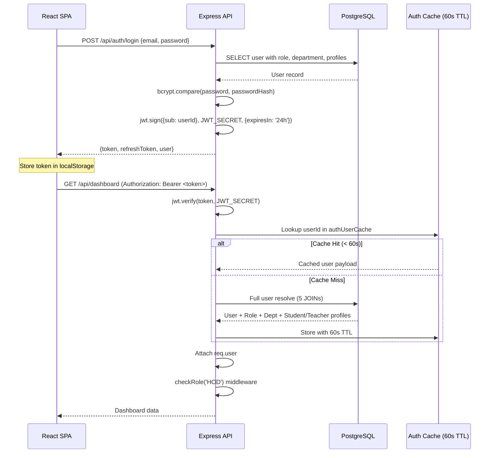

### 9.2 Security Measures

| Layer | Mechanism | Implementation |
|---|---|---|
| **Transport** | HTTPS (production) | Render managed TLS |
| **Headers** | Helmet.js | X-Frame-Options, X-Content-Type-Options, CSP |
| **CORS** | Whitelist-based | `CORS_ORIGINS` env var; strict in production, dev allows localhost |
| **Rate Limiting** | 500 req/15min per IP | `express-rate-limit` on `/api` prefix |
| **Authentication** | JWT (HS256) | 24-hour access token, secure refresh token in PostgreSQL |
| **Authorization** | RBAC middleware chain | `verifyToken` → `requireRole()` → `requirePermission()` |
| **Password Storage** | bcrypt (10 rounds) | Hashed in PostgreSQL `password_hash` column |
| **Password Reset** | Hashed OTP with expiry | `PasswordResetToken` table with `otpHash`, `expiresAt`, attempt counting |
| **Static File Security** | Extension whitelist | Only `.png/.jpg/.pdf/.xlsx/.csv/.doc/.txt` served; `..` traversal blocked |
| **Input Validation** | Pydantic (AI), Express validators | Request schemas enforced at API boundary |
| **SQL Injection** | Prisma ORM (parameterized) | All queries via Prisma Client; no raw SQL in controllers |

---

## 10. Role-Based Access Control (RBAC)

### 10.1 Permission Matrix

The system defines **28 granular permissions** organized into 7 categories:

```mermaid
graph TD
    subgraph "User Management"
        UM["USER_READ<br/>USER_CREATE<br/>USER_UPDATE<br/>USER_DELETE<br/>PASSWORD_RESET"]
    end
    subgraph "Institutional"
        IM["DEPARTMENT_MANAGE<br/>FACULTY_MANAGE<br/>HOD_ASSIGN / REMOVE<br/>AUDIT_LOG_VIEW<br/>SYSTEM_CONFIG"]
    end
    subgraph "Academic"
        AC["TIMETABLE_VIEW<br/>TIMETABLE_MANAGE<br/>TIMETABLE_GENERATE<br/>TIMETABLE_PUBLISH<br/>SUBJECT_MANAGE"]
    end
    subgraph "Attendance"
        AT["ATTENDANCE_READ_SELF<br/>ATTENDANCE_MARK<br/>ATTENDANCE_VIEW_ALL<br/>ATTENDANCE_OVERRIDE<br/>QUERY_SUBMIT / REVIEW / APPROVE<br/>CONSIDERATION_SUBMIT / REVIEW / APPROVE"]
    end
    subgraph "Leave"
        LV["LEAVE_APPLY<br/>LEAVE_REVIEW_TG<br/>LEAVE_APPROVE_HOD"]
    end
    subgraph "Student"
        ST["STUDENT_PROFILE_READ<br/>STUDENT_LIST_VIEW<br/>MENTEE_MONITOR"]
    end
    subgraph "AI"
        AI["AI_CHAT<br/>AI_TOOLS_EXECUTE"]
    end
```

### 10.2 Role → Permission Mapping

| Permission | Student | Teacher | TG | HOD | Admin |
|---|:---:|:---:|:---:|:---:|:---:|
| TIMETABLE_VIEW | ✅ | ✅ | ✅ | ✅ | ✅ |
| TIMETABLE_GENERATE | — | — | — | ✅ | ✅ |
| ATTENDANCE_READ_SELF | ✅ | — | — | — | — |
| ATTENDANCE_MARK | — | ✅ | ✅ | ✅ | — |
| ATTENDANCE_OVERRIDE | — | — | — | ✅ | — |
| ATTENDANCE_QUERY_SUBMIT | ✅ | — | — | — | — |
| ATTENDANCE_QUERY_REVIEW | — | — | ✅ | — | — |
| ATTENDANCE_QUERY_APPROVE | — | — | — | ✅ | — |
| CONSIDERATION_SUBMIT | ✅ | — | — | — | — |
| CONSIDERATION_REVIEW | — | — | ✅ | — | — |
| CONSIDERATION_APPROVE | — | — | — | ✅ | — |
| LEAVE_APPLY | ✅ | — | — | — | — |
| LEAVE_REVIEW_TG | — | — | ✅ | — | — |
| LEAVE_APPROVE_HOD | — | — | — | ✅ | — |
| MENTEE_MONITOR | — | — | ✅ | — | — |
| AI_CHAT | ✅ | ✅ | ✅ | ✅ | ✅ |
| AI_TOOLS_EXECUTE | — | ✅ | ✅ | ✅ | ✅ |
| USER_CREATE / UPDATE / DELETE | — | — | — | ✅ | ✅ |
| DEPARTMENT_MANAGE | — | — | — | — | ✅ |

> **Note:** Admin role automatically bypasses all permission checks via the `requireRole()` middleware.

---

## 11. Multi-Agent AI Orchestration Pipeline

### 11.1 Orchestration Flow

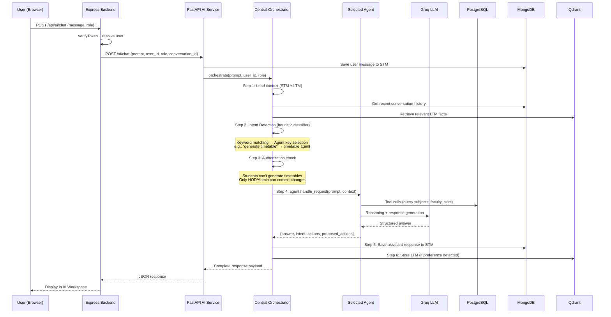

### 11.2 Intent Detection Classifier

The orchestrator uses a **fast heuristic keyword-based intent classifier** that routes queries to the appropriate agent without requiring an LLM call:

| Keywords Detected | Selected Agent |
|---|---|
| "generate timetable", "create timetable", "clash", "conflict" | `timetable` |
| "absent", "substitute", "adjust classes" | `teacher_absence` |
| "workload", "max periods", "teaching load" | `teacher_scheduling` |
| "attendance", "present count", "75%", "shortage" | `attendance` |
| "apply leave", "medical leave", "leave status" | `leave_management` |
| "export", "pdf", "excel", "download" | `file_generation` |
| "report", "audit", "summary" | `reporting` |
| "syllabus", "circular", "policy", "notes" | `rag` |
| "curriculum", "courses", "credits", "labs" | `academic_info` |
| *(default for HOD/Admin)* | `erp_assistant` |

---

## 12. Timetable Generation Engine

### 12.1 Generation Pipeline

```mermaid
graph LR
    A["HOD Request<br/>(Semester, Section, Constraints)"] --> B["Fetch from PostgreSQL<br/>(Subjects, Faculty, Rooms)"]
    B --> C["CSP Constraint Solver<br/>(scheduler/optimizer.py)"]
    C --> D["Slot Allocation<br/>(Day × Period × Subject × Teacher × Room)"]
    D --> E["Conflict Detection<br/>& Metrics Calculation"]
    E --> F["Save to PostgreSQL<br/>(Timetable + TimetableSlots)"]
    F --> G["Generate XLSX & PDF<br/>(tools/file_generator.py)"]
    G --> H["Return to Client<br/>(Slots + Files + Metrics)"]
```

### 12.2 Constraint Satisfaction Parameters

| Constraint | Description |
|---|---|
| **Teacher Availability** | No teacher assigned to overlapping slots |
| **Room Availability** | No room double-booked in same period |
| **Max Periods/Day** | Respect `teacher.maxPeriodsPerDay` (default: 4) |
| **Max Periods/Week** | Respect `teacher.maxPeriodsPerWeek` (default: 18) |
| **Weekly Hours** | Each subject allocated its `weeklyHours` worth of slots |
| **Working Days** | Configurable subset of Monday–Saturday |
| **Period Timings** | Custom start time, duration, breaks |
| **Lab Blocks** | Lab subjects grouped in consecutive double periods |

### 12.3 Timetable Lifecycle

```
DRAFT → APPROVED → ACTIVE → ARCHIVED
```

- **DRAFT**: Generated by AI, visible to HOD for review.
- **APPROVED**: HOD approved; ready for activation.
- **ACTIVE**: Published to all students and faculty; used for attendance tracking.
- **ARCHIVED**: Superseded by a newer version.

### 12.4 Daily Substitution Overlay

When a teacher is absent, the system creates `DailySubstitution` records that **overlay** the master timetable without mutating it:

```
TimetableSlot (Master, Immutable)
    ├── Teacher: Dr. Smith
    ├── Subject: Data Structures
    └── Day: Monday, Period 3

DailySubstitution (Overlay for 2026-10-04)
    ├── Original Teacher: Dr. Smith
    ├── Substitute Teacher: Dr. Jones
    ├── Status: ACTIVE
    └── Leave Application: REF-001
```

---

## 13. Document RAG Pipeline

### 13.1 Ingestion Flow

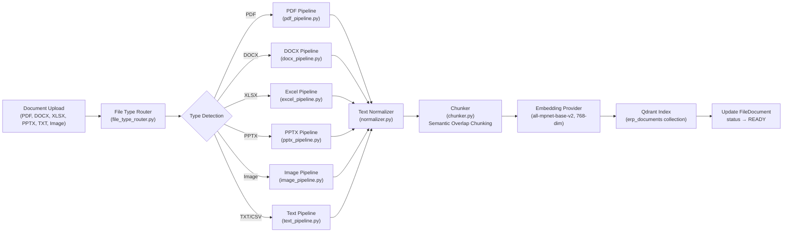

### 13.2 Retrieval Flow

```
User Query → Embedding → Qdrant Similarity Search (top_k=4)
    → Retrieved chunks with metadata (title, category, page, section)
    → LLM generates grounded response with citations
    → Return answer + source references
```

---

## 14. Real-Time Communication (Socket.IO)

### 14.1 Event Architecture

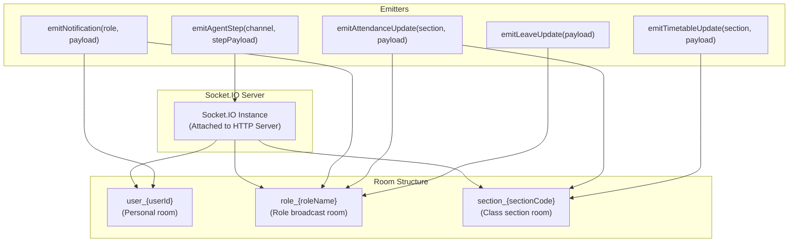

### 14.2 Event Types

| Event | Direction | Target | Trigger |
|---|---|---|---|
| `new_notification` | Server → Client | Role/User room | Leave status change, request update, notice publication |
| `attendance_updated` | Server → Client | Section + Teacher/HOD rooms | Attendance marked or corrected |
| `leave_updated` | Server → Client | TG + HOD + Student rooms | Leave application state change |
| `timetable_updated` | Server → Client | Section + Broadcast | Timetable published or substitution applied |
| `agent_step_{channel}` | Server → Client | Broadcast | AI agent execution progress |
| `join_user` | Client → Server | — | Client registers for personal notifications |
| `join_role` | Client → Server | — | Client joins role-based broadcast room |
| `join_section` | Client → Server | — | Client joins class section room |

---

## 15. File Processing Pipeline

### 15.1 Upload & Processing Flow

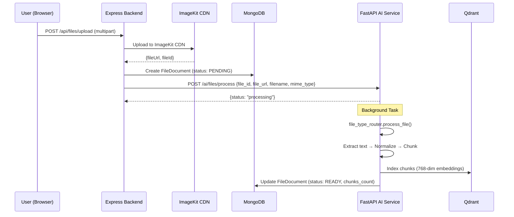

### 15.2 Supported File Types

| Type | Pipeline | Processing |
|---|---|---|
| PDF | `pdf_pipeline.py` | Text extraction, page-aware chunking |
| DOCX | `docx_pipeline.py` | Paragraph and heading extraction |
| XLSX/CSV | `excel_pipeline.py` | Sheet-by-sheet tabular data extraction |
| PPTX | `pptx_pipeline.py` | Slide content extraction |
| Images (JPG/PNG) | `image_pipeline.py` | OCR text extraction |
| TXT/Markdown | `text_pipeline.py` | Direct text processing |

---

## 16. Request & Approval Workflow Engine

### 16.1 Multi-Tier Approval Chain

All student requests follow a structured multi-tier approval workflow:

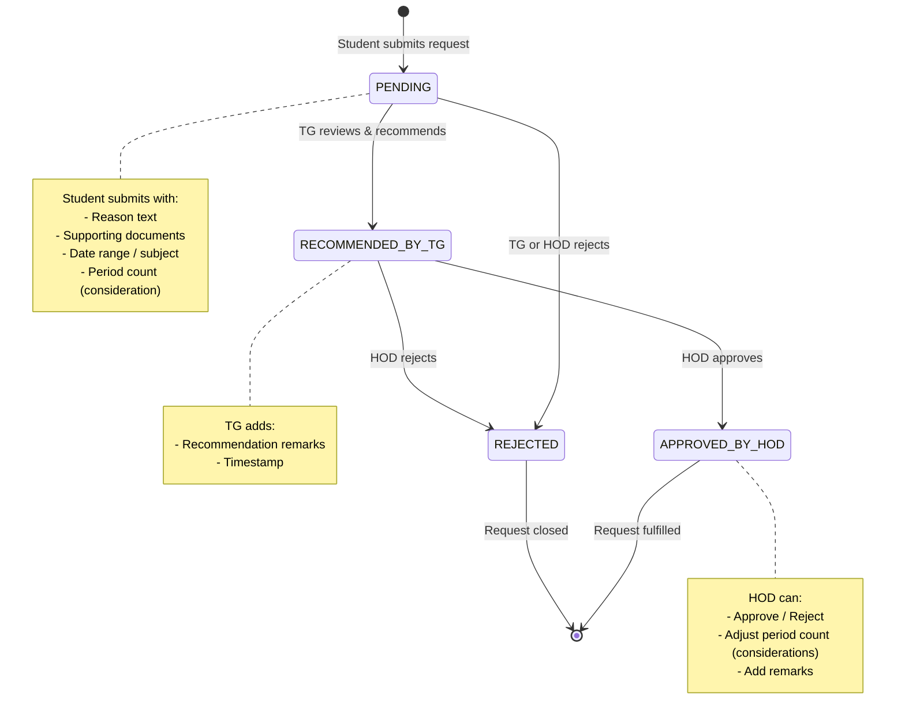

### 16.2 Request Types

| Type | Model | Workflow | Outcome |
|---|---|---|---|
| **Attendance Correction** | `AttendanceCorrectionRequest` | Student → TG → HOD | Corrects ABSENT to PRESENT in `AttendanceRecord` |
| **Attendance Consideration** | `AttendanceConsiderationRequest` | Student → TG → HOD | Grants attendance exemption for specified periods |
| **Leave Application** | `LeaveApplication` | Student → TG → HOD | Records approved leave, triggers substitution check |
| **Teacher Leave** | `LeaveApplication` | Teacher → HOD | Triggers absence analysis and substitution proposals |

---

## 17. Attendance Management System

### 17.1 Attendance Workflow

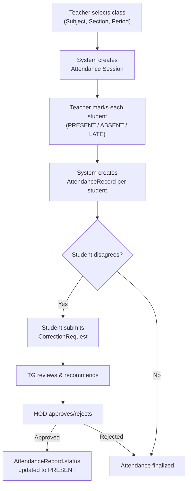

### 17.2 Verification Methods

| Method | Code | Description |
|---|---|---|
| Manual | `MANUAL` | Teacher marks directly from roster |
| QR Code | `QR` | Time-limited QR scan verification |
| AI Correction | `AI_CORRECTION` | Corrected via approved request |

---

## 18. Leave Management System

### 18.1 Leave Types

| Type | Code | Applicable To |
|---|---|---|
| Casual Leave | `CASUAL` | Students, Teachers |
| Medical Leave | `MEDICAL` | Students, Teachers |
| Duty Leave | `DUTY` | Teachers |
| On-Duty (OD) | `OD` | Students (events, competitions) |

### 18.2 Leave Processing Flow

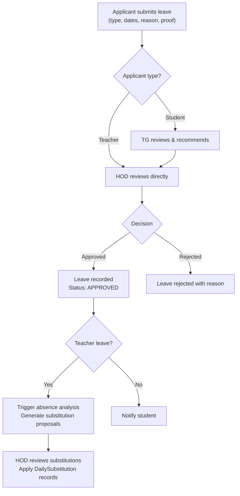

---

## 19. Data Models & Entity Relationship Diagram

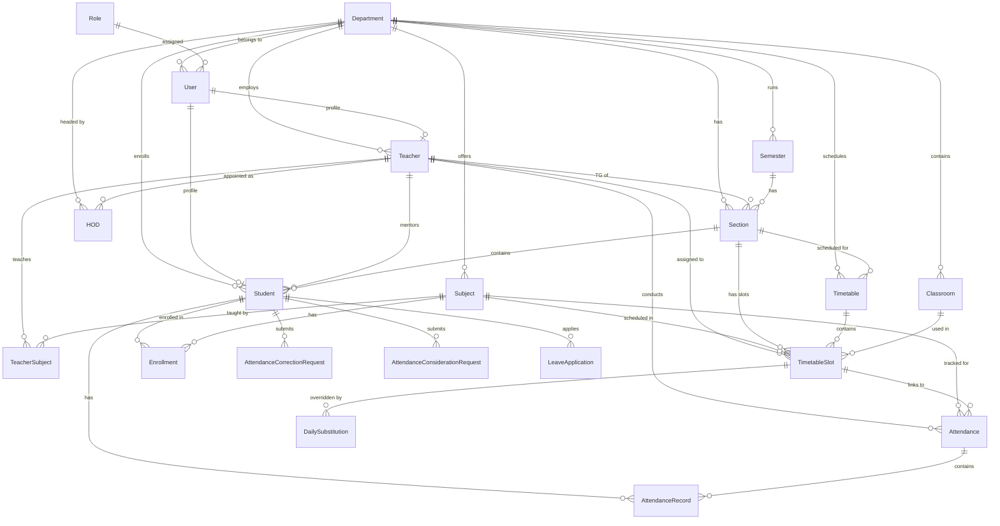

---

## 20. API Route Map

### 20.1 Complete Route Registry

All routes are mounted under `/api` and `/api/v1` (versioned alias):

| Prefix | Route File | Key Endpoints |
|---|---|---|
| `/api/auth` | `authRoutes.js` | `POST /login`, `POST /register`, `POST /refresh`, `POST /forgot-password`, `POST /reset-password`, `GET /me` |
| `/api/students` | `studentRoutes.js` | `GET /`, `GET /:id`, `PUT /:id`, `GET /:id/attendance` |
| `/api/faculty` | `facultyRoutes.js` | `GET /`, `POST /`, `PUT /:id`, `DELETE /:id`, `GET /:id/schedule`, `POST /:id/assign-tg` |
| `/api/attendance` | `attendanceRoutes.js` | `POST /mark`, `GET /summary`, `GET /student/:id`, `POST /qr/generate`, `POST /qr/verify` |
| `/api/timetable` | `timetableRoutes.js` | `GET /`, `GET /active`, `POST /generate`, `POST /:id/approve`, `POST /:id/activate`, `GET /slots` |
| `/api/ai` | `aiRoutes.js` | `POST /chat`, `POST /chat/stream`, `GET /sessions`, `DELETE /sessions/:id` |
| `/api/requests` | `requestRoutes.js` | `POST /correction`, `POST /consideration`, `GET /pending`, `PUT /:id/review`, `PUT /:id/approve` |
| `/api/leaves` | `leaveRoutes.js` | `POST /apply`, `GET /`, `PUT /:id/recommend`, `PUT /:id/approve`, `PUT /:id/reject` |
| `/api/notices` | `noticeRoutes.js` | `GET /`, `POST /`, `PUT /:id`, `DELETE /:id` |
| `/api/dashboard` | `dashboardRoutes.js` | `GET /stats`, `GET /today-schedule`, `GET /recent-activity` |
| `/api/master-data` | `masterDataRoutes.js` | `POST /teachers/import`, `POST /students/import`, `POST /subjects/import`, `GET /*/export` |
| `/api/files` | `fileRoutes.js` | `POST /upload`, `GET /:id`, `GET /:id/status` |
| `/api/notifications` | `notificationRoutes.js` | `GET /`, `PUT /:id/read`, `PUT /read-all` |
| `/api/classrooms` | `classroomRoutes.js` | `GET /`, `POST /`, `PUT /:id`, `DELETE /:id` |
| `/api/teacher-scheduler` | `teacherSchedulerRoutes.js` | `POST /absence`, `GET /substitutions`, `POST /apply-substitutions` |
| `/api/admin` | `adminRoutes.js` | `GET /users`, `POST /users`, `PUT /users/:id`, `POST /appoint-hod` |
| `/api/academic` | `academicRoutes.js` | `GET /departments`, `GET /semesters`, `GET /sections`, `POST /sessions` |
| `/api/agents` | `agentRoutes.js` | `GET /status`, `GET /runs` |
| `/api/health` | `index.js` | `GET /health`, `GET /health/db`, `GET /health/ai`, `GET /health/qdrant` |

### 20.2 AI Service Endpoints (FastAPI)

| Method | Path | Purpose |
|---|---|---|
| `POST` | `/ai/chat` | Central multi-agent chat (orchestrated) |
| `POST` | `/ai/chat/stream` | Streaming chat (SSE) |
| `POST` | `/ai/timetable/generate` | Deterministic timetable generation |
| `POST` | `/ai/timetable/export/excel` | XLSX export |
| `POST` | `/ai/timetable/export/pdf` | PDF export |
| `POST` | `/ai/teacher-scheduler/analyze` | Teacher absence analysis |
| `POST` | `/ai/teacher-scheduler/apply` | Apply substitution proposals |
| `POST` | `/ai/rag/index` | Index document into Qdrant |
| `POST` | `/ai/rag/search` | Semantic search across documents |
| `POST` | `/ai/files/process` | Background file processing |
| `GET` | `/ai/files/{id}/content` | Retrieve processed file chunks |
| `GET` | `/health` | Service health check |
| `GET` | `/health/db` | Database connectivity check |
| `GET` | `/health/qdrant` | Qdrant status check |
| `GET` | `/health/ai` | LLM provider status |

---

## 21. Frontend Page Architecture & Routing

### 21.1 Route Protection Model

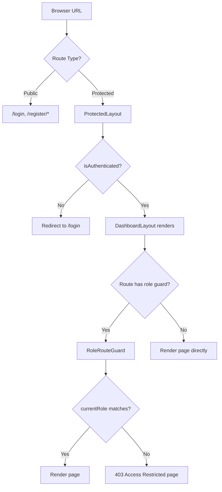

### 21.2 Layout Composition

```
<ERPProvider>                          (Global auth + state context)
  <Routes>
    <Route /login>                     (Public: LoginWrapper)
    <Route /register/*>                (Public: Registration pages)
    <Route / element={ProtectedLayout}>  (Auth required)
      <DashboardLayout>
        <Header />                     (Top bar: logo, search, notifications, profile)
        <Sidebar />                    (Role-based navigation with badges)
        <main>
          <Outlet />                   (Matched page component)
        </main>
        <AIChatWidget />               (Floating AI assistant, hidden on /ai-workspace)
        <GlobalModals />               (Leave modal, notice modal, etc.)
      </DashboardLayout>
      
      <Route /ai-workspace>           (Full AI Workspace, inherits shell)
      <Route /student/*>              (Guarded by role="student")
      <Route /teacher/*>              (Guarded by role="teacher")
      <Route /tg/*>                   (Guarded by role="tg" + isTG check)
      <Route /hod/*>                  (Guarded by role="hod")
      <Route /admin/*>                (Guarded by role="admin")
    </Route>
  </Routes>
</ERPProvider>
```

---

## 22. Deployment Architecture

### 22.1 Docker Compose (Development & Self-Hosted)

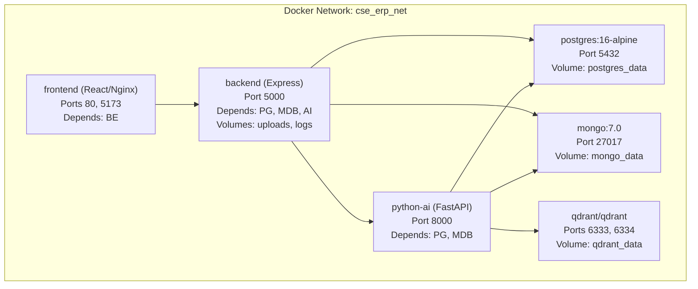

### 22.2 Render Cloud (Production)

The `render.yaml` blueprint defines:

| Service | Type | Runtime | Plan |
|---|---|---|---|
| `cse-erp-postgres` | Database | PostgreSQL (managed) | Starter |
| `cse-erp-backend` | Web Service | Node.js | Starter |
| `cse-erp-ai-service` | Web Service | Python | Starter |
| `cse-erp-frontend` | Static Site | Nginx (built Vite) | Free |

**Deployment Pipeline:**
1. Push to GitHub → Render auto-detects changes
2. Backend: `npm install` → `npm run migrate` (Prisma) → `npm start`
3. AI Service: `pip install -r requirements.txt` → `uvicorn main:app`
4. Frontend: `npm install` → `npm run build` → Serve `dist/` with SPA rewrite rules

---

## 23. Monitoring & Health Checks

### 23.1 Health Endpoint Hierarchy

| Endpoint | Checks | Status Codes |
|---|---|---|
| `GET /api/health` | PostgreSQL + MongoDB + FastAPI + Qdrant | `200` (ok/degraded), `503` (error) |
| `GET /api/health/databases` | PostgreSQL + MongoDB + Qdrant individually | `200` (HEALTHY/DEGRADED), `503` (UNHEALTHY) |
| `GET /api/health/db` | PostgreSQL (Prisma) + MongoDB readyState | `200` / `503` |
| `GET /api/health/ai` | FastAPI service reachability | `200` (UP / STANDALONE_FALLBACK) |
| `GET /api/health/qdrant` | Qdrant collections availability | `200` (UP / STANDALONE) |

### 23.2 Degradation Hierarchy

```
PostgreSQL DOWN → System UNHEALTHY (503) → Core ERP inoperable
MongoDB DOWN   → System DEGRADED (200)  → AI memory stateless, ERP functional
Qdrant DOWN    → System DEGRADED (200)  → RAG/LTM unavailable, AI operational
FastAPI DOWN   → System DEGRADED (200)  → AI chat unavailable, ERP fully functional
```

---

## 24. External Service Integrations

### 24.1 Integration Map

| Service | Purpose | Configuration | Fallback |
|---|---|---|---|
| **Groq Cloud** | LLM inference (Qwen-2.5-Coder-32B) | `GROQ_API_KEY` | Deterministic agent responses without LLM reasoning |
| **ImageKit** | CDN file storage and image processing | `IMAGEKIT_PUBLIC_KEY`, `IMAGEKIT_PRIVATE_KEY`, `IMAGEKIT_URL_ENDPOINT` | Local `/uploads` directory |
| **Brevo/Sendinblue** | Transactional email (OTP, notifications) | `BREVO_API_KEY`, `BREVO_SENDER_EMAIL` | Email silently skipped with warning log |
| **Google Sheets** | Bidirectional data synchronization | `GOOGLE_SHEETS_API_KEY` | Manual Excel import/export |
| **Qdrant Cloud** | Managed vector database (production) | `QDRANT_URL`, `QDRANT_API_KEY` | Local Qdrant instance or embedded mode |
| **MongoDB Atlas** | Managed MongoDB (production) | `MONGODB_URI` | Local MongoDB or stateless AI mode |

---

## 25. Glossary

| Term | Definition |
|---|---|
| **ERP** | Enterprise Resource Planning — integrated management of core business processes |
| **TG** | Tutor Guardian — a teacher appointed as academic mentor for a group of students |
| **HOD** | Head of Department — administrative head with approval authority |
| **CSP** | Constraint Satisfaction Problem — algorithmic approach used for timetable optimization |
| **RAG** | Retrieval-Augmented Generation — AI technique grounding LLM responses in retrieved documents |
| **STM** | Short-Term Memory — session-level conversational context stored in MongoDB |
| **LTM** | Long-Term Memory — persistent user facts and preferences stored as vectors in Qdrant |
| **RBAC** | Role-Based Access Control — permission model where access is granted based on user roles |
| **JWT** | JSON Web Token — compact, URL-safe token format for authentication |
| **ORM** | Object-Relational Mapping — Prisma Client for type-safe PostgreSQL access |
| **ODM** | Object-Document Mapping — Mongoose for MongoDB schema management |
| **SSE** | Server-Sent Events — streaming protocol used for AI chat token streaming |
| **CORS** | Cross-Origin Resource Sharing — browser security policy for API access |
| **IST** | Indian Standard Time — `Asia/Kolkata` timezone used for all schedule calculations |

---

*This document is the canonical reference for the CampusFlow ERP system architecture. For implementation details, refer to the source code and inline documentation in each module.*

**Document Version:** 2.0.0  
**Last Updated:** October 2026  
**Repository:** CampusFlow — College Departmental Agentic ERP
